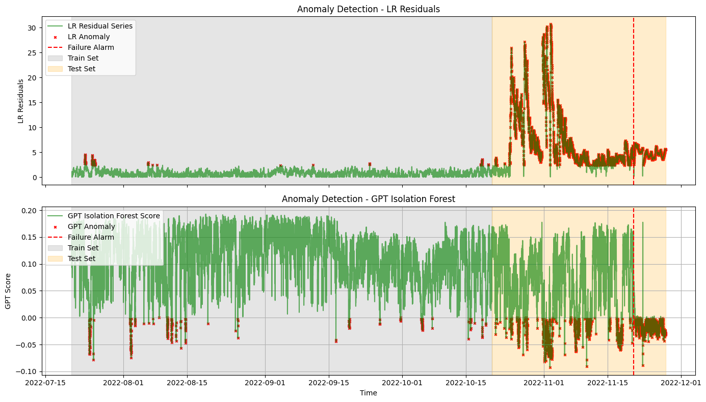

# Prompt_Engineer_Challenge
Test out your ability as an AI prompt engineer to implemnt wind turbine fault monitoring!

Download the .zip file and ask GPT to attempt to assess the health of your turbine! 

hint: There is a generator failure that occurs during the testing set, use the training set to give GPT some context or dont...  

# Anomaly Detection Visualization

This project demonstrates how to visualize anomaly detection results from:
- A Linear Regression (LR) model
- A GPT-based Isolation Forest

The notebook highlights:
- Detected anomalies
- The failure alarm time
- Training and test periods

## 📊 Example Output



## 📁 Files

- `ExampleResults_GPT_vs_LR-NBM.ipynb`  : Interactive version with plots and explanations
- `DS2_data.zip`                 : Compressed File containing...
                                    - 'DS2_train_data.pkl'           : 3 month training period of SCADA data
                                    - 'DS2_test_data.pkl'            : Followed by a ~1 month test period where a Bearing Failure occured
- `DS2_results.csv`: CSV file with anomaly scores, and labels

## ▶️ How to Run results example

```bash
pip install -r requirements.txt
jupyter notebook
